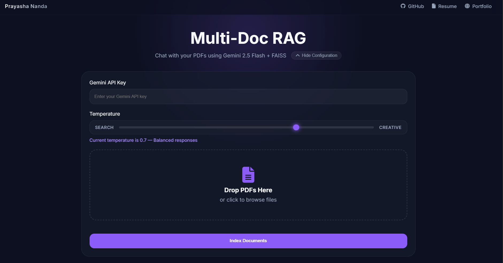
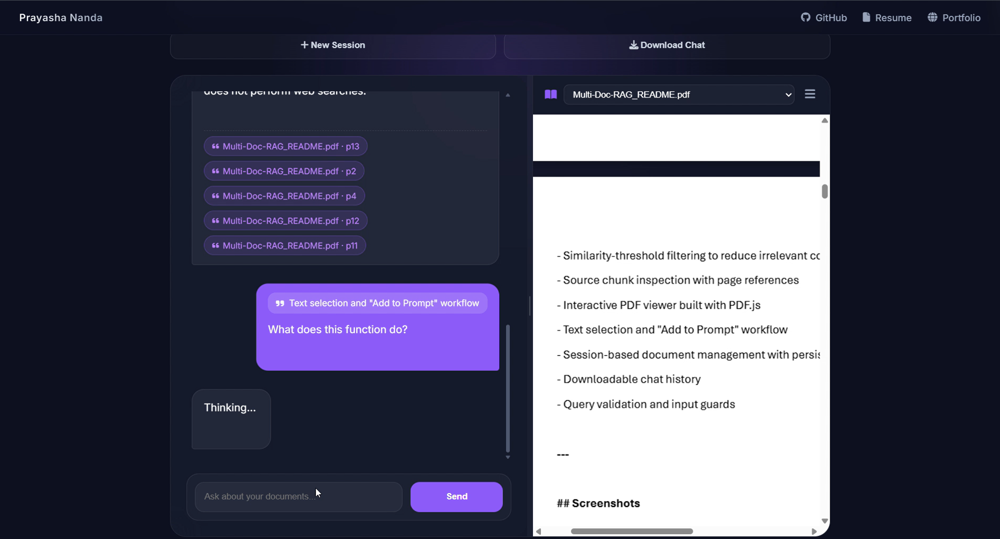
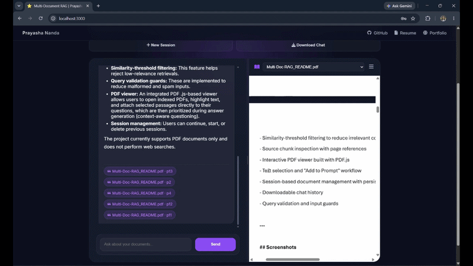

# Multi-Document RAG Chatbot

Upload one or more PDFs, build a semantic search index using FAISS and Gemini embeddings, and ask natural-language questions about the contents.

The system retrieves the most relevant document chunks, filters low-relevance matches using a similarity threshold, and generates grounded answers using Retrieval-Augmented Generation (RAG). Retrieved source chunks are exposed to the user for transparency and verification.

<p align="center">
  
  
  
  
  
</p>

---

## Project Structure

```text
Multi-Doc-RAG/
│
├── backend/
│   ├── app.py
│   │
│   └── rag/
│       ├── chat.py
│       ├── embeddings.py
│       ├── guards.py
│       ├── pdf_processor.py
│       └── vector_store.py
│
├── frontend/
│   ├── index.html
│   ├── styles.css
│   └── chat.js
│
├── indexes/                    # This is in .gitignore
│
├── samples/                    # For demonstration purposes
│
└── README.md
```

---

## Features

- Multi-document PDF question answering
- Gemini Embeddings + FAISS vector search
- Similarity-threshold filtering to reduce irrelevant context
- Source chunk inspection with page references
- Interactive PDF viewer built with PDF.js
- Text selection and "Add to Prompt" workflow
- Session-based document management with persistent indexing
- Downloadable chat history
- Query validation and input guards

---

## Screenshots

### Configuration Menu



### Chat Interface + PDF Viewer



### Demonstration of Context Selection + Source Chunk Inspection



---

## Technical Highlights

- Built a Retrieval-Augmented Generation (RAG) pipeline using Gemini embeddings and FAISS.
- Implemented similarity-threshold filtering to reject low-relevance retrievals.
- Added query validation guards to reduce malformed and spam inputs.
- Developed a PDF.js-based document viewer with contextual passage selection.
- Evaluated retrieval quality across 15 benchmark queries and analyzed chunk utilization.

---

## Architecture

```text
PDF Upload
     │
     ▼
Text Extraction
     │
     ▼
Chunking
     │
     ▼
Gemini Embeddings
     │
     ▼
FAISS Index
     │
     ▼
User Query
     │
     ▼
Similarity Search
     │
     ▼
Threshold Filtering
     │
     ▼
Context Construction
     │
     ▼
Gemini 2.5 Flash
     │
     ▼
Answer + Sources
```

Documents are chunked using a `RecursiveCharacterTextSplitter` and embedded using Gemini embeddings before being indexed in FAISS.

---

## Evaluation Results

The system was evaluated using 15 manually curated queries covering:

- Direct factual retrieval
- Multi-chunk synthesis
- Unsupported-information queries
- Hallucination resistance scenarios

Temperature set: 0.0 (Deterministic)

| Metric | Result |
|----------|----------:|
| Total Queries Tested | **15** |
| Pass | **11** |
| Partial | **3** |
| Fail | **1** |
| Pass Rate | **73.30%** |
| Pass + Partial Rate | **93.30%** |
| Weighted Success Rate = (Pass + 0.5 × Partial) / Total | **83.30%** |
| Average Chunks Retrieved | **3.73 / 5** |
| Average Chunks Used | **2.07 / 5** |

### Key Findings

- Achieved a **73.3% full-pass rate** across benchmark queries.
- Achieved a **93.3% pass-or-partial rate**.
- Retrieved an average of **3.73 chunks** per query.
- Generated responses using an average of **2.07 chunks**, indicating successful filtering of irrelevant context.
- Only **1 query resulted in a complete failure**.
- These results indicate that the LLM was generally grounded in retrieved document content, using the PDF as the source of truth.

Find the entire analysis in the [excel sheet](samples/evaluation_of_my_RAG.xlsx): `samples/evaluation_of_my_RAG.xlsx`

---

## Installation

### 1. Clone the Repository

```bash
git clone https://github.com/prayasha-nanda/Multi-Doc-RAG.git

cd Multi-Doc-RAG
```

---

### 2. Create a Virtual Environment

```bash
python -m venv venv
```

Activate it:

#### Windows

```bash
venv\Scripts\activate
```

#### Linux / macOS

```bash
source venv/bin/activate
```

---

### 3. Install Dependencies

```bash
pip install -r requirements.txt
```

---

### 4. Start the Backend

```bash
uvicorn app:app --reload
```

Backend will run on: http://127.0.0.1:8000

---

### 5. Start the Frontend

Using Python:

```bash
python -m http.server 3000
```

Then open: http://localhost:3000

Enter your Gemini API key and one or more PDF documents. The temperature is set to 0.7 by default. After clicking on **Index Documents**, the system will extract the PDF's text and create embeddings to build a FAISS vector index.

Then you can ask questions about the uploaded documents!

Examples:

* Summarize the report.
* What are the key findings?
* Explain chapter 4.
* Compare the conclusions of both papers.
* What evidence supports this claim?

---

## Source Attribution

Every response includes supporting document chunks with:

* File name
* Page number
* Original retrieved content

Users can inspect retrieved chunks directly through the interface.

The terminal will output the chunks (with the source pdf and the page number used), the chunks that are retained after filtering, the similarity scores (Euclidean distance), and the latency.

This helps improve transparency for users and help with debugging.

---

## Session Management

Each upload creates a unique session.

Sessions store:

* FAISS vector index
* Chunk metadata
* Uploaded PDF files

This allows users to restore previous sessions, reopen indexed documents, and continue querying without re-uploading files.

Users can:

* Continue previous sessions
* Start a new session
* Delete existing sessions (but session files stored locally in the folder `backend/indexes` has to be deleted manually)

---

## PDF Viewer

Indexed PDFs can be reopened directly inside the application using PDF.js.

Users can highlight text inside a document and attach it directly to a question using the **Add to Prompt** button.

---

## Context-Aware Questioning

In addition to standard document search, when users attach a selected passage from a PDF to their question, the selected passage is:

1. Added to the retrieval query
2. Prioritized during answer generation
3. Passed separately to the LLM as user-selected context

This helps improve retrieval quality for questions that reference specific parts of a document.

---

## Retrieval Configuration

| Setting | Value |
|----------|---------:|
| Embedding Model | Gemini Embeddings |
| Vector Store | FAISS |
| Top-k Retrieval | 5 |
| Similarity Threshold | 0.90 |
| Generation Model | Gemini 2.5 Flash |
| Temperature | 0.70 (user configurable) |

---

## Limitations

* Supports PDF documents only
* Answers are intended to be grounded in uploaded documents only
* The system does not perform web searches
* Scanned/image-only PDFs are not currently supported
* Similarity threshold tuning may affect recall and precision
* Large collections may require additional optimization

---

## Future Improvements

* OCR support for scanned PDFs
* Hybrid search (Keyword + Vector)
* Web search integration
* Conversation memory
* Citation highlighting inside documents
* Docker deployment
* Cloud storage support

---

## Why RAG?

Large Language Models can hallucinate or lack access to private information.

Retrieval-Augmented Generation improves reliability by retrieving relevant document context before generating a response.

Instead of relying solely on the model's training data, answers are grounded in the user's uploaded documents.

---
## Built by yours truly...

Prayasha Nanda, in my hunt to learn more and create more.

---

## License

MIT License.

Copyright (c) 2026 Prayasha Nanda